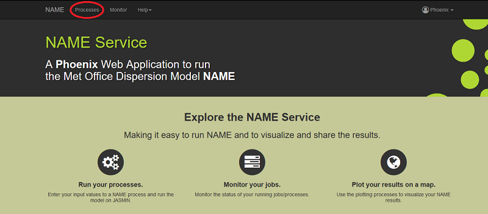
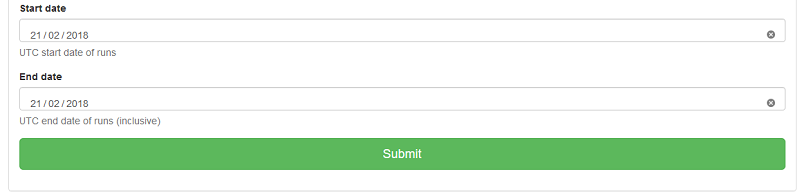
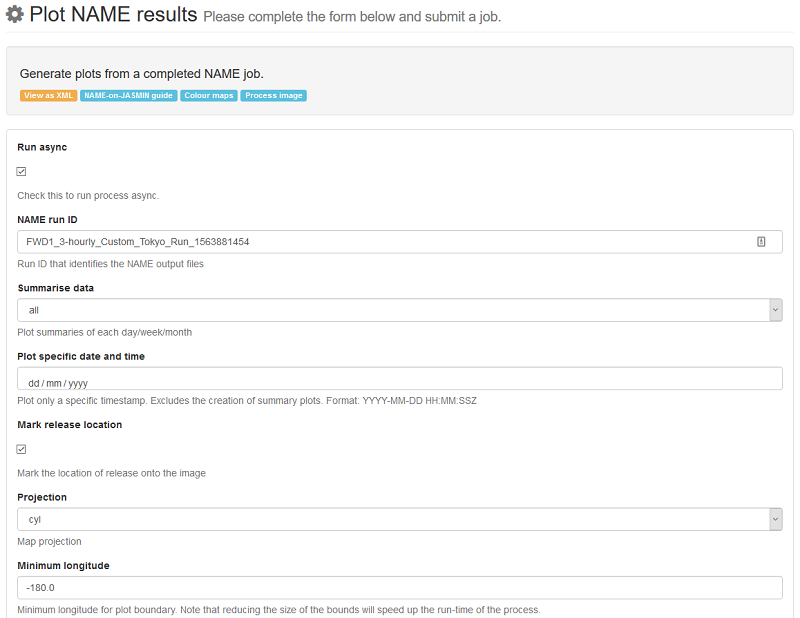
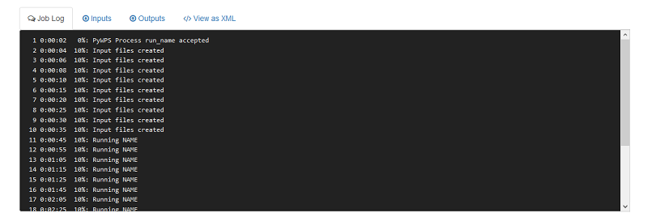
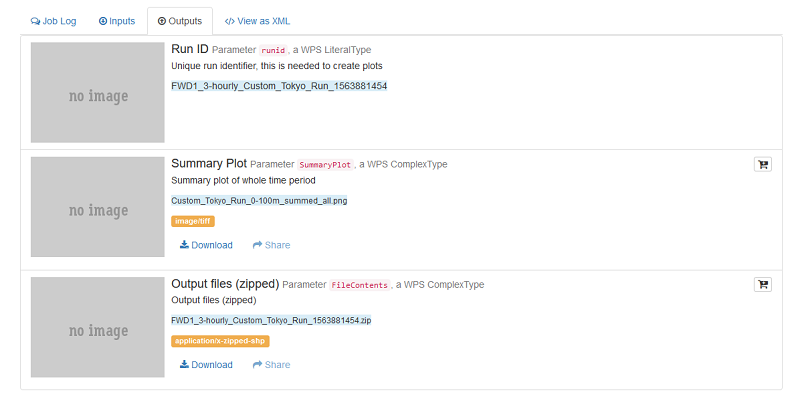

# NAME Service User Documentation

## Overview of NAME Trajectory service

[**NAME**](https://www.metoffice.gov.uk/research/modelling-systems/dispersion-model) is the Met Office's *Numerical Atmospheric-dispersion Modelling Environment*.  
This site offers a Web Processing Service for users to be able to run [NAME on JASMIN](http://jasmin.ac.uk/jasmin-users/stories/processing/).  

## Quick start

To get started [login](#signing-in) with your CEDA account.  
Once logged in go to [Processes](#the-processes) and select **NAME**.  
Select one of the three processes:  
* [Run NAME](#run-name)  
* [Run NAME for defined locations](#run-name-for-defined-locations)  
* [Plot NAME results](#plot-name-results)  

Enter your inputs and submit the job.
Go to the [Monitor](#monitoring-your-jobs) tab to view the progress of your job.  
Here you can see the outputs of your jobs. The outputs will vary depending on the job that was run.  

## Signing in

To sign in click "Sign in".  
  
If you are not already signed into a CEDA account you will be asked to log in:  
  
Once logged in you will be asked to let NAME WPS read your CEDA profile. Click Allow:  
  
You should now be signed in with your CEDA username. This lets you come back and see your completed jobs.  
  

## The Processes

To run a process, click on [Processes](https://name.ceda.ac.uk/processes).  
  
Select [**NAME**](https://name.ceda.ac.uk/processes/list?wps=name).  
  
Then select one of the following three processes:  

### Run NAME

  
[**Run NAME**](https://name.ceda.ac.uk/processes/execute?wps=name&process=run_name) runs NAME with the user providing all inputs, including location of release and bounding box.  
You must title the run something unique to refer to the job.  

#### Inputs

| Name | Description | Type | Default | Required | Example Value |
|------------|---------------------------|---------|-------------|----------|-----------------------|
|[Run async](https://name.ceda.ac.uk/processes/execute?wps=name&process=run_name#item-deformField2)| Whether to run the process asynchronously. | Boolean | True | Yes | True |
|[Title](https://name.ceda.ac.uk/processes/execute?wps=name&process=run_name#item-deformField3)| Unique name that will identify your job later. Note that spaces will be converted to underscored. | String | None | Yes | Custom Tokyo Run |
|[Longitude](https://name.ceda.ac.uk/processes/execute?wps=name&process=run_name#item-deformField4)| The longitude of the location of release in decimal degrees. Longitude cannot exceed +/-180. | Float | None | Yes | 139.74556 |
|[Latitude](https://name.ceda.ac.uk/processes/execute?wps=name&process=run_name#item-deformField5)| The latitude of the location of release in decimal degrees. Latitude cannot exceed +/-90. | Float | None | Yes | 35.658611 |
|[Elevation](https://name.ceda.ac.uk/processes/execute?wps=name&process=run_name#item-deformField6)| Dictates the elevation of the release in metres above ground level. | Integer | 10 | No | 10 |
|[Run Backwards](https://name.ceda.ac.uk/processes/execute?wps=name&process=run_name#item-deformField7)| Whether NAME will run backwards from the time selected or not. | Boolean | True | No | False |
|[Time to run model over](https://name.ceda.ac.uk/processes/execute?wps=name&process=run_name#item-deformField8)| How long the model will be run over in selected units. Note that the maximum run length is 20 days. | Integer | 1 | Yes | 1 |
|[Time to run model over (units)](https://name.ceda.ac.uk/processes/execute?wps=name&process=run_name#item-deformField9)| Units to use for *Time to run model over*. Either **days** or **hours**. | String | days | Yes | days |
|[Minimum longitude](https://name.ceda.ac.uk/processes/execute?wps=name&process=run_name#item-deformField10)| The minimum longitude that makes up the Bounding Box in which the plot will be generated. | Float | -180 | Yes | 100 |
|[Maximum longitude](https://name.ceda.ac.uk/processes/execute?wps=name&process=run_name#item-deformField11)| The maximum longitude that makes up the Bounding Box in which the plot will be generated. | Float | 180 | Yes | 180 |
|[Minimum latitude](https://name.ceda.ac.uk/processes/execute?wps=name&process=run_name#item-deformField12)| The minimum latitude that makes up the Bounding Box in which the plot will be generated. | Float | -90 | Yes | 0 |
|[Minimum latitude](https://name.ceda.ac.uk/processes/execute?wps=name&process=run_name#item-deformField13)| The minimum latitude that makes up the Bounding Box in which the plot will be generated. | Float | 90 | Yes | 90 |
|[Output elevation averaging range(s)](https://name.ceda.ac.uk/processes/execute?wps=name&process=run_name#item-deformField14)| The output elevation ranges you which to calculate the particle dispersion within. Multiple values can be added by continuing to click on the blue link. Note that values entered here must be two numbers separated by a dash. | List | [0-100] | Yes | [0-100] |
|[Resolution](https://name.ceda.ac.uk/processes/execute?wps=name&process=run_name#item-deformField16)| The resolution to run NAME within. The options are 0.05 or 0.25 degrees. Note that we don't recommend using 0.05 degrees for runs longer than 5 days. | Float | 0.25 | No | 0.25 |
|[Run Type](https://name.ceda.ac.uk/processes/execute?wps=name&process=run_name#item-deformField17)| How often you want the simulated particles released each day, either daily (i.e. once) or 3-hourly (8 times). | String | 3-hourly | Yes | 3-hourly |
|[Daily run time (UTC)](https://name.ceda.ac.uk/processes/execute?wps=name&process=run_name#item-deformField18)| If you selected "daily" run time above, you can then choose at what time you want the particles released. | Time | 12:00 | No | None |
|[Daily release length](https://name.ceda.ac.uk/processes/execute?wps=name&process=run_name#item-deformField19)| If you selected "daily" run time above, you can then choose how long you want your releases to last in hours from a selection (1, 3, 6, 12 or 24). | Int | 1 | No | 1 |
|[Start date](https://name.ceda.ac.uk/processes/execute?wps=name&process=run_name#item-deformField20)| Start date that you'd like NAME to run within. Note, this time is inclusive and as with all NAME time parameters is considered within the Coordinated Universal Time (UTC) and not any local timezone. | Date | None | Yes | 21/02/2018 |
|[End date](https://name.ceda.ac.uk/processes/execute?wps=name&process=run_name#item-deformField21)| End date that you'd like NAME to run within. Note, this time is inclusive and as with all NAME time parameters is considered within the Coordinated Universal Time (UTC) and not any local timezone. | Date | None | Yes | 21/02/2018 |

#### Example Inputs

  
  

#### Outputs

| Name | Description | Type | Example |
|------------|-------------------------------------|---------|-------------------------|
|[Run ID](https://name.ceda.ac.uk/EXAMPLE-OUTPUT)| Unique ID used to fidn this job later. This can be used as an input to plot a jon with the [Plot NAME results](#plot-name-results) process. | String | FWD1_3-hourly_Custom_Tokyo_Run_1563881454 |
|[Output files (zipped)](https://name.ceda.ac.uk/EXAMPLE-OUTPUT)| Zip folder containing the raw NAME data output and the summary plot. | File | Custom_Tokyo_Run_0-100m_summed_all.png |
|[Summary Plot](https://name.ceda.ac.uk/EXAMPLE-OUTPUT)| Generated plot from NAME run that summarises all data into one plot. | File | FWD1_3-hourly_Custom_Tokyo_Run_1563881454.zip |

#### Example Outputs

  

### Run NAME for defined locations

  
[**Run NAME for defined locations**](https://name.ceda.ac.uk/processes/execute?wps=name&process=run_name_preset) runs NAME from a choice of predefined standard releases. These will set for you the release location, bounding box and elevation.  

#### Inputs

| Name | Description | Type | Default | Required | Example Value |
|------------|---------------------------|---------|-------------|----------|-----------------------|
|[Run async](https://name.ceda.ac.uk/processes/execute?wps=name&process=run_name#item-deformField2)| Whether to run the process asynchronously. | Boolean | True | Yes | True |
|[Release Station](https://name.ceda.ac.uk/processes/execute?wps=name&process=run_name#item-deformField3)| Release location defines the latitude, longitude and elevation of the particle release, as well as the computational domain. | String | Cape Verde | Yes | Cape Verde |
|[Run Backwards](https://name.ceda.ac.uk/processes/execute?wps=name&process=run_name#item-deformField4)| Whether NAME will run backwards from the time selected or not. | Boolean | True | No | True |
|[Run time](https://name.ceda.ac.uk/processes/execute?wps=name&process=run_name#item-deformField5)| How long the model will be run over in days. Note that the maximum run length is 20 days. | Integer | 1 | Yes | 1 |
|[Output elevation averaging range(s)](https://name.ceda.ac.uk/processes/execute?wps=name&process=run_name#item-deformField6)| The output elevation ranges you which to calculate the particle dispersion within. Multiple values can be added by continuing to click on the blue link. Note that values entered here must be two numbers separated by a dash. | List | [0-100] | Yes | [0-100] |
|[Resolution](https://name.ceda.ac.uk/processes/execute?wps=name&process=run_name#item-deformField8)| The resolution to run NAME within. The options are 0.05 or 0.25 degrees. Note that we don't recommend using 0.05 degrees for runs longer than 5 days. | Float | 0.25 | No | 0.25 |
|[Start date](https://name.ceda.ac.uk/processes/execute?wps=name&process=run_name#item-deformField9)| Start date that you'd like NAME to run within. Note, this time is inclusive and as with all NAME time parameters is considered within the Coordinated Universal Time (UTC) and not any local timezone. | Date | None | Yes | 11/02/2017 |
|[End date](https://name.ceda.ac.uk/processes/execute?wps=name&process=run_name#item-deformField10)| End date that you'd like NAME to run within. Note, this time is inclusive and as with all NAME time parameters is considered within the Coordinated Universal Time (UTC) and not any local timezone. | Date | None | Yes | 11/02/2017 |

#### Example Inputs

  
  

#### Outputs

| Name | Description | Type | Example |
|------------|-------------------------------------|---------|-------------------------|
|[Run ID](https://name.ceda.ac.uk/EXAMPLE-OUTPUT)| Unique ID used to fidn this job later. This can be used as an input to plot a jon with the [Plot NAME results](#plot-name-results) process. | String | BCK1_3-hourly_Cape_Verde_1563884002 |
|[Output files (zipped)](https://name.ceda.ac.uk/EXAMPLE-OUTPUT)| Zip folder containing the raw NAME data output and the summary plot. | File | Cape_Verde_0-100m_summed_all.png |
|[Summary Plot](https://name.ceda.ac.uk/EXAMPLE-OUTPUT)| Generated plot from NAME run that summarises all data into one plot. | File | BCK1_3-hourly_Cape_Verde_1563884002.zip |

#### Example Outputs

  

### Plot NAME Results

  
[**Plot NAME Results**](https://name.ceda.ac.uk/processes/execute?wps=name&process=plot_name) Takes the outputs of another NAME run and then plots the results with user defined parameters.  

#### Inputs

| Name | Description | Type | Default | Required | Example Value |
|------------|---------------------------|---------|-------------|----------|-----------------------|
|[Run async](https://name.ceda.ac.uk/processes/execute?wps=name&process=run_name#item-deformField2)| Whether to run the process asynchronously. | Boolean | True | Yes | True |
|[NAME run ID ](https://name.ceda.ac.uk/processes/execute?wps=name&process=run_name#item-deformField3)| The only required parameter to generate plots is the NAME run ID. This must be an ID that was generated by the NAME WPS from a previous run. To find the run ID, navigate to the [Monitor](https://name.ceda.ac.uk/monitor) tab and find the run you wish to plot an copy it's Run ID. For more details: [Monitor](#monitoring-your-jobs). | String | None | Yes | FWD1_3-hourly_Custom_Tokyo_Run_1563881454 |
|[Summarise data](https://name.ceda.ac.uk/processes/execute?wps=name&process=run_name#item-deformField4)| This will add the particle concentration values for each day, week or month. The all option summarises all the data within this NAME run into a single plot. | String | NA | No | all |
|[Plot specific date and time](https://name.ceda.ac.uk/processes/execute?wps=name&process=run_name#item-deformField5)| Instead of summarising the data, you could select one particular time-point to plot by entering a date and time into the following field. Note that if anything is entered into this box any summary selection will be ignored. | DateTime | None | No | None |
|[Mark release location](https://name.ceda.ac.uk/processes/execute?wps=name&process=run_name#item-deformField6)| Mark the release site onto the plots with a cross. | Boolean | False | No | True |
|[Projection](https://name.ceda.ac.uk/processes/execute?wps=name&process=run_name#item-deformField7)| Change the projection from the default of cyl, to either npstere or spstere. | String | cyl | No | cyl |
|[Minimum longitude](https://name.ceda.ac.uk/processes/execute?wps=name&process=run_name#item-deformField8)| The minimum longitude that makes up the Bounding Box in which the plot will be generated. | Float | -180 | Yes | -180 |
|[Maximum longitude](https://name.ceda.ac.uk/processes/execute?wps=name&process=run_name#item-deformField9)| The maximum longitude that makes up the Bounding Box in which the plot will be generated. | Float | 180 | Yes | 180 |
|[Minimum latitude](https://name.ceda.ac.uk/processes/execute?wps=name&process=run_name#item-deformField10)| The minimum latitude that makes up the Bounding Box in which the plot will be generated. | Float | -90 | Yes | -90 |
|[Minimum latitude](https://name.ceda.ac.uk/processes/execute?wps=name&process=run_name#item-deformField11)| The minimum latitude that makes up the Bounding Box in which the plot will be generated. | Float | 90 | Yes | 90 |
|[Particle concentration scale](https://name.ceda.ac.uk/processes/execute?wps=name&process=run_name#item-deformField12)| The scale of the particle concentration can be changed by entering a minimum and maximum value. If left empty each plot will autoscale based on the containing data. | String | None | No | None |
|[Colour map](https://name.ceda.ac.uk/processes/execute?wps=name&process=run_name#item-deformField13)| The colour scheme used can be changed from coolwarm to either viridis or rainbow. Note we do not recommend using rainbow as it is not colour-blind friendly. | String | coolwarm | No | rainbow |

#### Example Inputs

  
  

#### Outputs

| Name | Description | Type | Example |
|------------|-------------------------------------|---------|-------------------------|
|[Plot file(s)](https://name.ceda.ac.uk/EXAMPLE-OUTPUT)| File or files generated from plotting NAME output data. | Files | Custom_Tokyo_Run_0-100m_summed_all.png |

#### Example Outputs

  

## Monitoring your jobs

Go to the [Monitor](https://name.ceda.ac.uk/monitor) tab to view the progress of your jobs.  
  
Click on the green refresh icon to check the status of the job.  
  
Click on Details to see a running log of the job process.  
Here there is:  
A *Job Log*: a log of how the job is currently doing.  
  
*Inputs*:  a list of all the inputs you provided.  
  
*Outputs*: the ouputs of the job which will vary depending on the process run.  
  
*View as XML*: A way to view the WPS XML response of your job. Most users will not use this view.  
  

## Further Information
